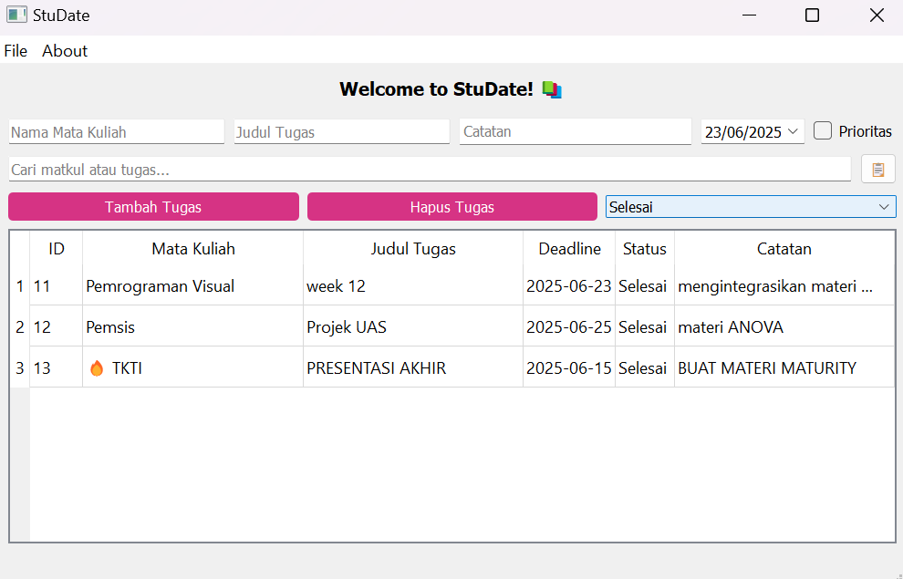

# pv25-finalproject-StuDate

Aplikasi **StuDate (Student Daily Assignment & Task Entry)** adalah aplikasi manajemen tugas kuliah berbasis PyQt5. Aplikasi ini membantu mahasiswa dalam mencatat, mengelola, dan memantau tugas harian secara efisien. Antarmuka dibangun langsung menggunakan kode Python tanpa bantuan Qt Designer, dan data disimpan menggunakan database SQLite lokal. Fitur utama termasuk tambah tugas, edit status, pencarian, filter, ekspor ke CSV, serta penggunaan clipboard dan status bar.

## Tampilan Aplikasi

<table align="center">
  <tr>
    <td align="center"></td>
    <td align="center"></td>
    <td align="center"></td>
  </tr>
  <tr>
    <td align="center"></td>
    <td align="center"></td>
    <td align="center"></td>
  </tr>
  <tr>
    <td align="center"></td>
    <td align="center"></td>
    <td align="center"></td>
  </tr>
  <tr>
    <td align="center"></td>
    <td align="center"></td>
    <td align="center"></td>
  </tr>
</table>
